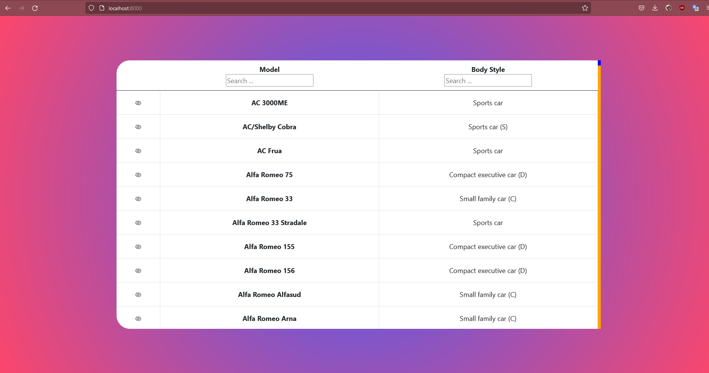

# scrape-serve-view


## How to run

````
npm install
npm run start
````

Then visit localhost:8000/ for UI
In UI: For search bars you can concatenate your terms with ";". So "BMW;3000" will search for 2 distinct terms and give you result.

Scrape, server and UI are in its seperate folder.




UI: Svelte, bootstrap CDN
Server: typescript, node.js
scrapper: node.js


